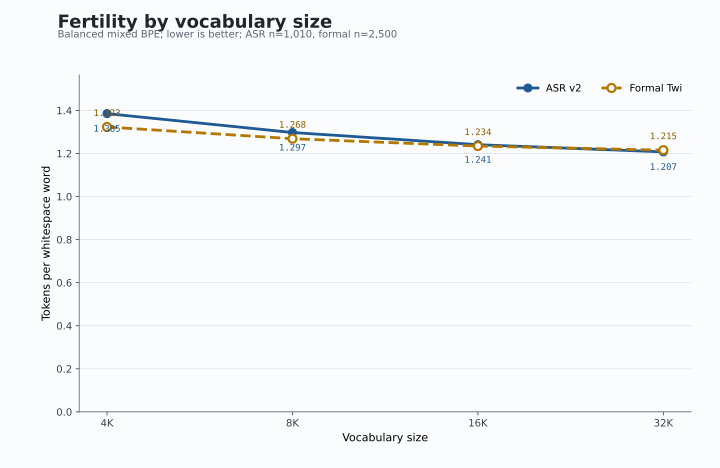

# Akan-BPE Technical Report

**Eliminating the Tokenization Tax for Akan through Specialized BPE Tokenizers**

## Executive Summary

This report documents the Akan-BPE project, which investigates the "Tokenization Tax" — the phenomenon where African languages like Akan require significantly more tokens than English under standard LLM tokenizers. We demonstrate that specialized BPE tokenizers trained on domain-specific Akan corpora can reduce token requirements by approximately 46–47% compared to strong multilingual baselines (XLM-RoBERTa, mBERT, mT5).

**Key Results:**
- ASR tokenizer reduces fertility from 2.322 to 1.225 tokens/word (~47% reduction vs best multilingual baseline, mT5) on the leak-corrected 1,010-sample ASR revision-v2 test set
- TTS tokenizer reduces fertility from 2.356 to 1.263 tokens/word (~46% reduction vs best multilingual baseline, mBERT)
- Balanced mixed tokenizer differentiates across domains: 1.297 (ASR) and 1.268 (TTS)
- The historical ML router achieves 99.99% source-corpus classification accuracy, but is retained
  only as secondary analysis because no ambiguous-domain challenge set was evaluated
- The 5-run model ladder and M4 generation-quality evaluation are preserved in the executed split notebooks and consolidated in `results/notebook-ladder-results.json`.
- Mean-of-subword embedding initialization beats random initialization in every rung, lowering perplexity, BPB, chrF, and chrF++ without extra training.
- The notebook-derived artifact shows all five mean-of-subword arms beat their base model on corrected full-coverage BPB while cutting token use by 44.7-58.9%.
- The earlier negative Llama/Aya signs were artifacts of the old truncated BPB calculation. Under full-byte coverage, the Akan-tokenizer fine-tunes win across all five families/scale points.
- A controlled 4K/8K/16K/32K mixed-BPE ablation selects 32K for new reviewer experiments under the predeclared two-domain 1% rule; because only the upper boundary qualifies, controlled model-quality evidence may still override this tokenizer-only choice.

---

## 1. Introduction

### 1.1 Background

Modern large language models (LLMs) use subword tokenization, typically Byte Pair Encoding (BPE), to convert text into discrete tokens. These tokenizers are predominantly trained on English-dominant corpora, resulting in what we term the "Tokenization Tax" for low-resource languages:

- Languages with non-Latin scripts require more tokens per word
- Morphologically rich languages fragment into more subwords
- Conversational/text speech transcriptions tokenize inefficiently

### 1.2 Problem Statement

For Akan (Twi), a Ghanaian language spoken by approximately 11 million people, strong multilingual tokenizers still require:
- ~2.32–2.41 tokens per word on conversational ASR text (XLM-R, mBERT, mT5)
- ~2.36–2.51 tokens per word on formal text (XLM-R, mBERT, mT5)

This inefficiency increases inference latency, costs, and may degrade generation quality — even for models specifically trained on multilingual data.

### 1.3 Hypothesis

We hypothesized that training specialized BPE tokenizers on domain-specific Akan corpora would yield more efficient tokenization:
- **ASR Tokenizer**: Trained on conversational Akan speech transcriptions
- **TTS Tokenizer**: Trained on formal Akan text (e.g., news, literature)
- **Mixed Tokenizer**: Trained on both corpora combined

Additionally, we hypothesized that a router could dynamically select the appropriate tokenizer based on input characteristics.

---

## 2. Data Sources

### 2.1 ASR Corpus

| Source | Type | Train Samples |
|--------|------|---------------|
| `google/WaxalNLP` - `aka_asr` | Conversational transcriptions | 8,085 |

The historical local split contained 8,085 train / 1,011 validation / 1,011 test rows. A revision
audit found one normalized sentence shared by train row 4,250 and historical test row 368 under
different IDs. Revision v2 preserves train and validation, removes only that test row, and freezes
the active boundary at 8,085 / 1,011 / 1,010. The original v1 test and its results remain
hash-pinned for reproducibility; all numbers below use the leak-free v2 test.

**Characteristics:**
- Noisy, conversational text
- Speech fillers and abbreviations
- Code-switching tolerant
- Shorter average sentence length

### 2.2 TTS Corpus

| Source | Type | Train Samples |
|--------|------|---------------|
| `ghananlpcommunity/pristine-twi-english` | Clean formal text | 45,000 |

Local 80/10/10 split: 45,000 train / 2,500 validation / 2,500 test.

**Characteristics:**
- Structured, grammatically clean
- More formal and semantically dense
- Higher punctuation density
- Longer average sentence length

### 2.3 Data Processing

All data was normalized and converted to JSONL format with the following schema:
```json
{"id": "sample_id", "text": "akan text", "source": "aka_asr|pristine_twi"}
```

---

## 3. Methodology

### 3.1 Tokenizer Training

We trained three BPE tokenizer variants using the `tokenizers` library:

| Tokenizer | Training Corpus | Vocab Size | Special Tokens |
|-----------|-----------------|------------|----------------|
| ASR | 8,085 ASR samples | 8,000 | `[PAD]`, `[UNK]`, `[CLS]`, `[SEP]`, `[MASK]`, `<s>`, `</s>`, `<pad>` |
| TTS | 45,000 TTS samples | 8,000 | Same as ASR |
| Mixed | 45,000 ASR (upsampled) + 45,000 TTS = 90,000 | 8,000 | Same as ASR |

All tokenizers used identical hyperparameters to ensure fair comparison: BPE with whitespace pre-tokenization, an 8,000-token target vocabulary, and the shared special-token set above. The mixed tokenizer uses corpus balancing: the ASR corpus (8,085 samples) is upsampled by repetition to match the TTS corpus size (45,000), preventing the larger corpus from dominating the vocabulary.

### 3.2 Metric: Token Fertility

We use **token fertility** as the primary evaluation metric:

```
F = total_tokens / total_words
```

Lower fertility indicates more efficient tokenization — fewer tokens required per word.

### 3.3 Router Design

We implemented two routing approaches:

**3.3.1 Heuristic Router**
- Rule-based classification using:
  - Average word length
  - Punctuation density
  - Presence of formal punctuation (semicolons, quotes)
- Simple decision tree logic

**3.3.2 ML Classifier Router**
- TF-IDF vectorizer (max 5,000 features, unigrams + bigrams)
- Logistic Regression classifier
- Trained on 80% of 53,085 labeled samples (8,085 ASR + 45,000 TTS), stratified split
- Evaluated on held-out 20% test set (10,617 samples)
- Train accuracy: 99.99% | Test accuracy: 99.99%

---

## 4. Experiments

### 4.1 Experiment 1: Tokenizer Fertility Benchmark

**Setup:**
- Test set 1: ASR revision-v2 test (1,010 samples)
- Test set 2: TTS test (2,500 samples)
- Baselines: XLM-RoBERTa (`xlm-roberta-base`), mBERT (`bert-base-multilingual-cased`), mT5 (`google/mt5-base`)
- Tokenizers: ASR, TTS, Mixed (balanced)

**Results:**

| Tokenizer | ASR Test Fertility | TTS Test Fertility |
|-----------|-------------------|-------------------|
| XLM-RoBERTa | 2.405 | 2.495 |
| mBERT | 2.335 | 2.356 |
| mT5 | 2.322 | 2.511 |
| ASR | **1.225** | 1.538 |
| TTS | 1.488 | **1.263** |
| Mixed (balanced) | 1.297 | 1.268 |

**Key Findings:**
- ASR tokenizer achieves best fertility (1.225) on ASR text — ~47% reduction vs best multilingual baseline (mT5, 2.322)
- TTS tokenizer achieves best fertility (1.263) on TTS text — ~46% reduction vs best multilingual baseline (mBERT, 2.356)
- Balanced mixed tokenizer differentiates across domains: 1.297 on ASR vs 1.268 on TTS
- Specialization hypothesis confirmed: domain-specific tokenizers outperform both general multilingual and mixed tokenizers

### 4.2 Experiment 2: Routing Accuracy

> **Secondary-analysis scope.** This experiment distinguishes the source corpus of ASR
> transcriptions from separately collected formal text. It does not test ambiguous, mixed-register,
> code-switched, or out-of-domain routing and is not treated as a central paper contribution.

**Setup:**
- Test ASR test set (ground truth: ASR domain)
- Test TTS test set (ground truth: TTS domain)
- Compare heuristic vs ML router

**Results:**

| Router Type | ASR Test (Correct) | TTS Test (Correct) |
|-------------|------------------|-------------------|
| Heuristic | 80.2% (810/1,010) | 77.6% (1,939/2,500) |
| ML Classifier | **100%** (1,010/1,010) | **99.9%** (2,498/2,500) |

**Key Findings:**
- ML classifier substantially outperforms the heuristic on these two source corpora
- Heuristic router misclassifies 22.4% of TTS samples as ASR and 19.8% of ASR samples as TTS
- ML router reduces TTS misclassification from 22.4% to 0.1% and routes the ASR test set perfectly
- Near-perfect source-corpus separation does not establish generalization to ambiguous input

### 4.3 Experiment 3: End-to-End Fertility with Router

**Setup:**
- Compare fertility using router-selected tokenizer vs fixed tokenizers

**Results:**

| Strategy | TTS Test Fertility | Improvement vs Best Baseline (mBERT 2.356) |
|----------|-------------------|------------------------------------------|
| Always mBERT | 2.356 | — |
| Always ASR | 1.538 | 35% |
| Always TTS | 1.263 | 46% |
| Heuristic Router | 1.32 | 44% |
| ML Router | **1.263** | **46%** |

**Key Findings:**
- On this formal-text source corpus, the ML route matches the always-TTS strategy
- Heuristic router loses ~4.5% efficiency due to misclassification

### 4.4 Experiment 4: Leak-Correction Checkpoint

The v1-v2 comparison was generated from the preserved result artifacts rather than copied
manually. Across all six tokenizers, the largest absolute fertility change was 0.000230. The
largest change in a headline reduction was 0.0042 percentage points, and the heuristic router
changed by -0.0196 percentage points. The best tokenizer in each domain and the mixed-tokenizer
deployment conclusion were unchanged. The correction therefore retains the historical model
ladder while making v2 mandatory for new reviewer experiments.

### 4.5 Experiment 5: Vocabulary-Size Ablation

Balanced mixed BPE tokenizers were trained at 4K, 8K, 16K, and 32K from the same frozen corpora
and trainer configuration, then evaluated on the active ASR v2 and formal test sets.

| Vocab | ASR fertility | ASR p95 | ASR utilization | Formal fertility | Formal p95 | Formal utilization | Tokenizer MiB |
|---:|---:|---:|---:|---:|---:|---:|---:|
| 4K | 1.384789 | 71 | 47.15% | 1.322836 | 491 | 93.05% | 0.244 |
| 8K | 1.297091 | 66 | 33.99% | 1.268425 | 473 | 86.26% | 0.502 |
| 16K | 1.240619 | 63 | 22.18% | 1.234157 | 461 | 70.69% | 1.028 |
| 32K | 1.207083 | 61 | 12.84% | 1.215197 | 453 | 47.62% | 2.097 |

The predeclared operational rule chooses the smallest vocabulary within 1% relative of the best
observed fertility in both domains. Only 32K qualifies, so it is locked for the new extension and
multi-seed experiments. This is a boundary selection rather than evidence of a fully observed
plateau: relative to 8K, 32K improves fertility while quadrupling the embedding-interface cost and
using only 12.84% of its vocabulary on ASR. Controlled model-quality evidence may override the
tokenizer-only choice. The newly trained 8K tokenizer has the same vocabulary and identical test
encodings as the historical mixed tokenizer, preserving the meaning of the existing model ladder.



### 4.6 Experiment 6: Vocabulary Extension Baseline (Intrinsic Checkpoint)

The extension baseline preserves Qwen's full tokenizer and appends every novel, non-special token
from the locked 32K mixed-BPE vocabulary. Of 32,000 candidates, eight are shared special tokens,
5,836 collide exactly with existing Qwen tokens, and 26,156 are appended. Round-trip tests confirm
that all 151,669 original token IDs remain unchanged.

| Strategy | ASR fertility | Reduction vs original | Formal fertility | Reduction vs original |
|---|---:|---:|---:|---:|
| Original Qwen | 2.393772 | — | 2.532663 | — |
| Extension (+26,156) | 1.841445 | 23.1% | 1.888727 | 25.4% |
| 32K replacement | **1.207083** | **49.6%** | **1.215197** | **52.0%** |

Paired bootstrap intervals exclude zero for every original/extension/replacement fertility
difference. Replacement is intrinsically more efficient, but this does not resolve model quality:
extension preserves Qwen's multilingual lexical interface while replacement discards it.

Qwen preallocates 151,936 embedding rows for its 151,669-token tokenizer. With the controlled
pipeline's untied input and output matrices, extension pads to 177,856 rows and adds 25,920 actual
model rows, or 53.08M parameters (101.25 MiB FP16). The complete extension lexical interface is
694.75 MiB FP16, versus 125.00 MiB for 32K replacement. A controlled Qwen run must now compare
full-coverage BPB, chrF/chrF++, downstream performance, throughput, and checkpoint size before the
adaptation strategy is selected.

---

## 5. Discussion

### 5.1 Specialization is Real

The results confirm that Akan text exists in at least two distinct regimes:
- **ASR/Conversational**: Noisy, short, punctuation-light
- **TTS/Formal**: Clean, structured, punctuation-heavy

Each regime benefits from a differently-trained tokenizer.

### 5.2 Mixed Tokenizer

With corpus balancing (ASR upsampled to match TTS at 45,000 samples each), the mixed tokenizer now genuinely interpolates between domains:
- ASR test fertility: **1.297** — better than TTS tokenizer (1.488) on conversational text
- TTS test fertility: **1.268** — marginally worse than TTS tokenizer (1.263) on formal text

This confirms that corpus imbalance, not domain incompatibility, was the root cause of the earlier null result. The balanced mixed tokenizer is a viable single-tokenizer option where routing infrastructure is unavailable, at a small cost (~0.4% fertility loss on TTS vs the domain-specific tokenizer).

### 5.3 Router Value

Routing is retained only as a secondary implementation analysis. The classifier uses word-level
TF-IDF (lowercased 1-2 grams, 5,000 maximum features, `min_df=2`, L2 normalization) followed by
logistic regression (`C=1`, L2-equivalent default objective, `lbfgs`, 1,000 maximum iterations,
random state 42). Its stratified 80/20 split draws from 53,085 source-labelled examples: 8,085 ASR
and 45,000 formal text. The 10,617-example holdout has 1,617/9,000 examples by class and one error,
for 99.9906% accuracy and macro F1 99.9818%; the confusion matrix, with rows=true and
columns=predicted in `[ASR, TTS]` order, is `[[1617, 0], [1, 8999]]`.

On the active external corpus tests, the ML confusion matrix is `[[1010, 0], [2, 2498]]`
(99.9430% accuracy; macro F1 99.9305%), versus `[[810, 200], [561, 1939]]` for the heuristic
(78.3191% accuracy; macro F1 75.8171%). These are source-corpus classification results, not
evidence about realistically ambiguous domains. No mixed/code-switched challenge set, routing
latency, tokenizer-switching overhead, or end-to-end model effect was measured. Moreover, separate
replacement tokenizers require compatible embedding interfaces and cannot be switched freely for
one frozen model checkpoint. The historical pickle was produced with scikit-learn 1.8.0 and emits
an inconsistent-version warning under 1.9.0. Accordingly, the balanced mixed tokenizer is the
primary deployment path; robust routing is deferred to future work. Exact settings and all
per-class metrics are in `results/router_audit_revision_v2.json`.

---

## 6. Technical Implementation

### 6.1 Project Structure

```
akan-bpe/
├── data/                   # Normalized datasets
│   ├── aka_asr_train.jsonl
│   ├── aka_asr_test.jsonl
│   ├── pristine_twi_train.jsonl
│   └── pristine_twi_test.jsonl
├── models/                  # Trained tokenizers
│   ├── asr_tokenizer.json
│   ├── tts_tokenizer.json
│   ├── mixed_tokenizer.json
│   └── router_classifier.pkl
├── results/                 # Experiment outputs
├── scripts/                 # CLI tools
│   ├── download.py
│   ├── train_bpe.py
│   ├── benchmark_fertility.py
│   ├── router.py
│   └── model_integration.py
├── akan_bpe/               # Core modules
│   ├── tokenizers.py
│   ├── router.py
│   ├── classifier.py
│   ├── metrics.py
│   ├── experiment.py
│   ├── datasets.py
│   ├── io.py
│   └── model_integration.py
├── notebooks/
│   ├── train_eval.ipynb
│   ├── run-full-light.ipynb
│   └── run-full-heavy.ipynb
├── results/
│   └── notebook-ladder-results.json
└── tests/
```

### 6.2 Usage

**Train a tokenizer:**
```bash
python scripts/train_bpe.py \
    --inputs data/aka_asr_train.jsonl \
    --output models/asr_tokenizer.json \
    --name asr
```

**Run fertility benchmark:**
```bash
python scripts/benchmark_fertility.py \
    --experiment-id experiment_001 \
    --baselines xlm-roberta-base bert-base-multilingual-cased google/mt5-base \
    --asr-tokenizer models/asr_tokenizer.json \
    --tts-tokenizer models/tts_tokenizer.json \
    --mixed-tokenizer models/mixed_tokenizer.json \
    --asr-test-file data/aka_asr_test.jsonl \
    --tts-test-file data/pristine_twi_test.jsonl \
    --output results/experiment_001.json
```

**Train ML router:**
```bash
python scripts/router.py train \
    --asr-train data/aka_asr_train.jsonl \
    --tts-train data/pristine_twi_train.jsonl \
    --output models/router_classifier.pkl
```

**Benchmark with ML router:**
```bash
python scripts/router.py benchmark \
    --config config/router_config.json \
    --test-file data/pristine_twi_test.jsonl \
    --output results/router_ml_benchmark.json \
    --use-ml
```

---

## 7. Conclusion

This project demonstrates that:

1. **Specialized tokenizers significantly reduce the Tokenization Tax** — Akan tokenizers trained on domain-specific corpora achieve ~46–47% reduction in token requirements compared to strong multilingual baselines (XLM-R, mBERT, mT5).

2. **Domain specialization is real** — ASR and TTS text benefit from different tokenizers, confirming the dual-regime hypothesis for Akan.

3. **Source-corpus classification is easy in the current data** — Logistic regression reaches
   99.99% on the held-out source labels, versus 78.3% externally for the heuristic, but this does
   not establish routing under ambiguous input and remains secondary analysis.

4. **Corpus balance unlocks the mixed tokenizer** — A balanced mixed tokenizer (equal corpus sizes via upsampling) genuinely interpolates between domains, making it a viable single-tokenizer option at minimal fertility cost.

### 7.1 Paper plan & future work

This work is being written up for an **IEEE Ghana ICAST 2026** submission. The paper plan
(`project.md` §0) prioritizes:

- **Methodology hardening (M2)**: bits-per-byte (BPB) for fair cross-tokenizer comparison, an
  embedding-init ablation (random vs mean-of-subword) as the modeling contribution, and a
  regenerated ASR test split so the dual-regime story is statistically valid.
- **Model evidence (M3)**: a 5-run set reported in BPB, chosen to span scale, family, base-vocab
  size, and pretraining multilinguality — `Qwen/Qwen3-0.6B`, `Qwen/Qwen3-1.7B`,
  `google/gemma-3-1b-pt`, `meta-llama/Llama-3.2-1B`, and `CohereLabs/tiny-aya-base`.
  The executed split notebooks are the source of truth and are consolidated in
  `results/notebook-ladder-results.json`.
- **Generation quality (M4)**: complete; chrF/chrF++ on 512 held-out Twi continuations per arm.

Deferred to future work (out of scope for the ICAST paper):

- **Stretch/reference tier**: `microsoft/Phi-4-mini-instruct` and `CohereLabs/aya-expanse-8b`
  (the latter non-commercial / reference-only) beyond the 5-run paper set
- **Edge Deployment (Phase 2B)**: full inference benchmark on resource-constrained hardware
  (Dell Latitude 7400); optional light latency note in the paper, otherwise future work
- **Additional Domains**: other Akan text types (social media, religious text, etc.)
- **Cross-lingual**: apply the methodology to other low-resource languages

---

## 8. Model integration — Qwen3-0.6B (`run-qwen-0.6b`)

**Goal:** Verify the tokenizer-swap pipeline end-to-end on a real model — replace a base
LLM's tokenizer with the balanced mixed Akan tokenizer, resize embeddings, fine-tune with QLoRA, and
confirm the fertility gain holds while generation stays coherent.

**Setup:**

| Item | Value |
|------|-------|
| Experiment ID | `run-qwen-0.6b-mixed` |
| Base model | `Qwen/Qwen3-0.6B` |
| Tokenizer | Balanced mixed tokenizer (`models/mixed_tokenizer.json`) |
| Method | QLoRA, 4-bit nf4, double quant, fp16 compute |
| LoRA targets | `q/k/v/o_proj`, `gate/up/down_proj` (r=16, α=32, dropout 0.05); embeddings + LM head saved |
| Hardware | Kaggle, single Tesla T4 (`CUDA_VISIBLE_DEVICES=0`) |
| Train / eval data | `pristine_twi_train.jsonl` / `pristine_twi_test.jsonl` |
| Epochs | 1 |

**Results:**

All numbers below are the **random embedding-init** arm (`run-qwen-0.6b-mixed`); the
mean-of-subword arm is reported in §8.1.

| Metric | Value |
|--------|-------|
| Base model tokenizer fertility (eval) | 2.530 tokens/word |
| Mixed tokenizer fertility (eval) | 1.264 tokens/word |
| Token reduction | **50.1%** |
| Eval loss | 4.4196 |
| Eval perplexity (Akan tokenizer only) | 83.06 |
| Base model BPB (eval) | 2.9523 bits/byte |
| Mixed-tokenizer model BPB (eval) | 1.4897 bits/byte |
| BPB improvement (base − experiment) | **+1.4626 bits/byte** |

> **Metric note — perplexity is not comparable across tokenizers.** The 82.65 perplexity above
> is a within-tokenizer training signal for the Akan-tokenizer model; it cannot be compared
> directly against the base model's perplexity because the two use different vocabularies and
> tokenize the same text into different numbers of tokens. The cross-tokenizer modeling claim
> instead uses **bits-per-byte (BPB)**, a tokenizer-agnostic metric (byte count is fixed
> regardless of tokenization), plus **chrF** for generation quality. See `project.md` §0.3 (M2/M4).
>
> **Status:** BPB is implemented in `akan_bpe/model_integration.py` (M2) and populated with
> corrected full-byte coverage — each run scores the base model and the fine-tuned model on the
> same eval bytes (`eval.bpb` in the result JSON). On the same 769,514 eval bytes the
> Akan-tokenizer model reaches **1.4897 BPB vs the base model's 2.9523** (random init), so the
> fine-tuned model is genuinely better per byte, not just per token. The embedding-init ablation
> (`--embedding-init-mode {random,mean_subword}`) is reported in §8.1.

**Key findings:**

- The ~46% fertility advantage measured in Phase 1 holds inside a real model context
  (50.1% on the eval set), confirming the tokenization gain is not an artifact of the
  benchmark harness.
- Training loss fell steadily from ~7.4 to convergence over one epoch; generation produces
  coherent Twi continuations rather than degenerate output.
- The full save → reload-from-adapter inference path was verified, so the run is
  reproducible and the artifact is usable downstream.
- Perplexity (82.65) is a first single-epoch within-tokenizer baseline; reducing it is a goal
  for the larger runs, but the headline cross-tokenizer claim moves to BPB (see the
  metric note above). Full executed outputs are preserved in `notebooks/run-full-light.ipynb`
  and consolidated in `results/notebook-ladder-results.json`.

### 8.1 Embedding-init ablation — random vs mean-of-subword

When the base tokenizer is swapped for the Akan tokenizer, the new vocabulary's embedding
rows have to be initialized. The M2 modeling contribution compares two schemes on an
otherwise identical QLoRA run (same data, tokenizer, and hyperparameters — only the init
differs):

- **`random`** — the default resize; new rows are randomly initialized.
- **`mean_subword`** — each Akan token's embedding is seeded from the **mean of the base
  model's subword embeddings** for that token's surface string (global mean as fallback),
  giving every new row a warm, semantically grounded start. The same scheme is applied to
  the LM head when output embeddings are untied.

| Metric | `random` | `mean_subword` |
|--------|---------:|---------------:|
| Eval loss | 4.4196 | **3.8086** |
| Eval perplexity | 83.06 | **45.09** |
| Fine-tuned model BPB | 1.4897 | **1.2871** |
| Base model BPB | 2.9523 | 2.9523 |
| BPB improvement (base − experiment) | +1.4626 | **+1.6652** |

**Key findings:**

- **Mean-of-subword init is decisively better.** It cuts BPB from 1.4897 to **1.2871** and
  perplexity from 83.06 to **45.09** — a ~46% perplexity reduction — for zero extra training
  cost, simply by initializing the swapped embeddings more intelligently.
- Both arms beat the base model's 2.9523 BPB, but `mean_subword` widens the per-byte advantage
  (+1.6652 vs +1.4626 bits/byte), confirming the gain comes from the init, not the tokenizer swap
  alone.
- The base-model BPB is identical across arms (2.9523), as expected — it is the same frozen
  reference scored on the same eval bytes, which validates the comparison.
- **Recommendation:** `mean_subword` becomes the default embedding init for the M3 model ladder.

---

## 9. Model integration — Qwen3-1.7B scale step (`run-qwen-1.7b`)

**Goal:** The M3 ladder's **scale anchor** (§0.3). run-qwen-1.7b-mixed is a config clone of run-qwen-0.6b-mixed — same balanced mixed
tokenizer, same data, same QLoRA recipe, same single-T4 Kaggle setup — with only the base model
swapped to `Qwen/Qwen3-1.7B`. Because the Qwen3 family shares a tokenizer, this isolates **model
scale** (0.6B → 1.7B) with the family held constant.

**Setup:**

| Item | Value |
|------|-------|
| Experiment ID | `run-qwen-1.7b` |
| Base model | `Qwen/Qwen3-1.7B` |
| Tokenizer | Balanced mixed tokenizer (`models/mixed_tokenizer.json`) |
| Method | QLoRA, 4-bit nf4, double quant, fp16 compute |
| LoRA targets | `q/k/v/o_proj`, `gate/up/down_proj` (r=16, α=32, dropout 0.05); embeddings + LM head saved |
| Hardware | Kaggle, single Tesla T4 (`CUDA_VISIBLE_DEVICES=0`) |
| Train / eval data | `pristine_twi_train.jsonl` / `pristine_twi_test.jsonl` |
| Epochs | 1 |

**Results (both embedding-init arms, same 769,514 eval bytes):**

| Metric | `random` | `mean_subword` |
|--------|---------:|---------------:|
| Base tokenizer fertility (eval) | 2.530 | 2.530 |
| Mixed tokenizer fertility (eval) | 1.264 | 1.264 |
| Token reduction | 50.1% | 50.1% |
| Eval loss | 4.4301 | **3.7040** |
| Eval perplexity | 83.94 | **40.61** |
| Fine-tuned model BPB | 1.4887 | **1.2505** |
| Base model BPB | 2.7556 | 2.7556 |
| BPB improvement (base − experiment) | **+1.2669** | **+1.5051** |

**Key findings:**

- **Scale changes the base but not the conclusion.** The 1.7B base reaches 2.7556 BPB under
  corrected full-byte coverage, and both Akan-tokenizer arms beat it.
- **Mean-of-subword init still wins decisively (+1.5051 BPB).** The warm-start init cuts BPB to
  1.2505 (perplexity 40.61), outperforming random init at 1.4887 BPB. This reinforces the
  run-qwen-0.6b §8.1 conclusion: mean-of-subword is the right default initialization.
- The 50.1% fertility reduction is identical to run-qwen-0.6b-mixed (same Qwen3 tokenizer), confirming the
  efficiency gain is a property of the tokenizer, independent of model scale.

---

## 10. Model integration — Gemma-3-1B family/vocab step (`run-gemma-1b`)

**Goal:** The M3 ladder's **multilinguality / base-vocab** rung (§0.3). run-gemma-1b swaps to a different
family (`google/gemma-3-1b-pt`) with a **~256k base vocab** — the largest in the ladder — and
strong multilingual pretraining. It tests two reviewer objections at once: (1) the tokenization tax
is a *Qwen quirk*, and (2) the tax is just an artifact of a small base vocab. If the Akan tokenizer
still helps a 256k-vocab multilingual model, neither objection holds.

**Setup:** identical recipe to the Qwen runs (balanced mixed tokenizer, `pristine_twi` train/eval, QLoRA 4-bit
nf4, 1 epoch, Kaggle single T4, `CUDA_VISIBLE_DEVICES=0`); base model `google/gemma-3-1b-pt`
(gated — PT/pretrained checkpoint, not IT, to avoid the SFT confound).

**Results (both embedding-init arms, same 769,514 eval bytes):**

| Metric | `random` | `mean_subword` |
|--------|---------:|---------------:|
| Base tokenizer fertility (eval) | 2.284 | 2.284 |
| Mixed tokenizer fertility (eval) | 1.264 | 1.264 |
| Token reduction | 44.7% | 44.7% |
| Eval loss | 4.4481 | **3.6700** |
| Eval perplexity | 85.47 | **39.25** |
| Fine-tuned model BPB | 1.4844 | **1.2411** |
| Base model BPB | 3.3908 | 3.3908 |
| BPB improvement (base − experiment) | **+1.9063** | **+2.1496** |

**Key findings:**

- **The tax survives a 256k vocab.** Even with the ladder's largest base vocab, Gemma still spends
  2.284 tokens/word on Twi; the 8k Akan tokenizer cuts that to 1.264 — a **44.7% reduction**. A big
  multilingual vocab narrows the tax (44.7% vs Qwen's 50.1%) but does not close it.
- **It is not a Qwen quirk.** A second, unrelated model family shows the same pattern — the Akan
  tokenizer + fine-tune improves per-byte modeling — killing the single-family objection.
- **Gemma's base is weak on Twi (3.3908 BPB).** Despite multilingual pretraining, the 1B Gemma base
  models Twi worse per byte than the Qwen bases. Because the base is weak, **both**
  init arms beat it comfortably here; the larger the base's native Akan gap, the more the method helps.
- **Mean-of-subword wins again, and biggest yet.** It cuts base BPB from 3.3907 to
  **1.2411** (+2.1496) and cuts perplexity from 85.47 to 39.25. Across all three rungs mean_subword
  is the best arm, confirming it as the ladder default.

### 10.1 Model ladder (M3/M4 complete)

Fertility is tokens/word on the eval set. BPB uses corrected full-byte coverage. chrF/chrF++ use
512 held-out Twi continuation examples per arm, with 48 prompt words, 64 reference words, and 64
max generated tokens. Source: `results/notebook-ladder-results.json`, derived from the executed
split notebooks.

| Model | Arm | Base fert. | Akan fert. | Token reduction | Base BPB | Akan BPB | BPB improvement | chrF | chrF++ | Perplexity |
|---|---:|---:|---:|---:|---:|---:|---:|---:|---:|---:|
| `qwen-0.6b` | `random` | 2.530 | 1.264 | 50.1% | 2.9523 | 1.4897 | +1.4626 | 15.11 | 14.93 | 83.06 |
| `qwen-0.6b` | `mean_subword` | 2.530 | 1.264 | 50.1% | 2.9523 | 1.2871 | +1.6652 | 16.90 | 16.94 | 45.09 |
| `llama-1b` | `random` | 3.073 | 1.264 | 58.9% | 2.4480 | 1.4265 | +1.0215 | 16.26 | 16.09 | 70.12 |
| `llama-1b` | `mean_subword` | 3.073 | 1.264 | 58.9% | 2.4480 | 1.2368 | +1.2112 | 18.73 | 18.73 | 39.02 |
| `aya-base` | `random` | 2.975 | 1.264 | 57.5% | 2.7129 | 1.4837 | +1.2292 | 17.42 | 17.37 | 83.07 |
| `aya-base` | `mean_subword` | 2.975 | 1.264 | 57.5% | 2.7129 | 1.2432 | +1.4697 | 18.52 | 18.48 | 39.40 |
| `qwen-1.7b` | `random` | 2.530 | 1.264 | 50.1% | 2.7556 | 1.4887 | +1.2669 | 13.44 | 13.33 | 83.94 |
| `qwen-1.7b` | `mean_subword` | 2.530 | 1.264 | 50.1% | 2.7556 | 1.2505 | +1.5051 | 18.72 | 18.65 | 40.61 |
| `gemma-1b` | `random` | 2.284 | 1.264 | 44.7% | 3.3908 | 1.4844 | +1.9063 | 15.31 | 15.30 | 85.47 |
| `gemma-1b` | `mean_subword` | 2.284 | 1.264 | 44.7% | 3.3908 | 1.2411 | +2.1496 | 17.46 | 17.58 | 39.25 |

**Reading the ladder:** three facts stand out. (1) The Akan tokenizer cuts tokens by **44.7-58.9%**
inside every model family. (2) Every mean-of-subword fine-tune beats its base model on corrected
BPB. (3) Mean-of-subword also beats random init on chrF/chrF++ in every run, closing M4 with
supportive automatic generation-quality evidence.

---

## 11. Model integration — Llama-3.2-1B English-centric step (`run-llama-1b`)

**Goal:** The M3 ladder's **English-centric, deployment-standard** rung (§0.3). `Llama-3.2-1B` has a
~128k base vocab and the weakest multilingual pretraining of the set, so it should show the
**largest tokenization tax** — and it does, by a wide margin. It is also the model that seeds Phase
2B edge work, so its behaviour matters for deployment.

**Setup:** identical recipe to the earlier rungs (balanced mixed tokenizer, `pristine_twi` train/eval, QLoRA 4-bit
nf4, 1 epoch, Kaggle single T4, `CUDA_VISIBLE_DEVICES=0`); base model `meta-llama/Llama-3.2-1B`
(gated — base/pretrained, not `-Instruct`, to avoid the SFT confound).

**Results (both embedding-init arms, same 769,514 eval bytes):**

| Metric | `random` | `mean_subword` |
|--------|---------:|---------------:|
| Base tokenizer fertility (eval) | 3.073 | 3.073 |
| Mixed tokenizer fertility (eval) | 1.264 | 1.264 |
| Token reduction | 58.9% | 58.9% |
| Eval loss | 4.2503 | **3.6640** |
| Eval perplexity | 70.12 | **39.02** |
| Fine-tuned model BPB | 1.4265 | **1.2368** |
| Base model BPB | 2.4480 | 2.4480 |
| BPB improvement (base − experiment) | **+1.0215** | **+1.2112** |

**Key findings:**

- **The largest tokenization tax in the ladder.** Llama's English-centric tokenizer spends **3.073
  tokens/word** on Twi; the Akan tokenizer cuts that to 1.264 — a **58.9% reduction**, the biggest
  efficiency win of any rung, confirming the predicted "weakest multilingual support → biggest tax."
- **Corrected full-byte BPB flips the old sign.** Llama's base is 2.4480 BPB under full coverage;
  random init improves to 1.4265 BPB, and mean-of-subword improves further to **1.2368 BPB**.
- **Mean-of-subword is still the better arm** (1.2368 vs 1.4265 BPB; perplexity 39.02 vs 70.12),
  confirming that warm-starting the resized embedding rows matters even when both arms beat base.

**Metric correction note.** Earlier drafts reported a negative Llama BPB sign because the original
scorer truncated text to `max_length-1` tokens but divided by the full byte count, which most
flattered high-fertility base tokenizers. The corrected scorer uses full byte coverage for both
base and experiment. The current values are now the notebook-derived JSON payloads in
`results/notebook-ladder-results.json`.

**What this means for the paper.** Llama is the strongest deployment-efficiency rung: it combines
the largest token reduction (58.9%) with a corrected BPB win for both initialization strategies.

---

## 12. Model integration — tiny-aya-base Africa-aware step (`run-aya-base`, M3 complete)

**Goal:** The M3 ladder's **Africa-aware multilingual** rung and final run (§0.3).
`CohereLabs/tiny-aya-base` (3.35B, a custom Cohere architecture with Africa/West-Asia-focused
pretraining) tests the hardest objection: does the Akan tokenizer still help a base *built* for
languages like Twi? It is the heaviest run and was deliberately scheduled **last**.

**Setup:** identical recipe to the earlier rungs (balanced mixed tokenizer, `pristine_twi` train/eval, QLoRA 4-bit
nf4, 1 epoch, Kaggle single T4, `CUDA_VISIBLE_DEVICES=0`); base model `CohereLabs/tiny-aya-base`
(the `-base` pretrained checkpoint, not `-earth`, to avoid the SFT confound).

**Results (both embedding-init arms, same 769,514 eval bytes):**

| Metric | `random` | `mean_subword` |
|--------|---------:|---------------:|
| Base tokenizer fertility (eval) | 2.975 | 2.975 |
| Mixed tokenizer fertility (eval) | 1.264 | 1.264 |
| Token reduction | 57.5% | 57.5% |
| Eval loss | 4.4196 | **3.6737** |
| Eval perplexity | 83.07 | **39.40** |
| Fine-tuned model BPB | 1.4837 | **1.2432** |
| Base model BPB | 2.7129 | 2.7129 |
| BPB improvement (base − experiment) | **+1.2292** | **+1.4697** |

**Key findings:**

- **The tax holds even for an Africa-aware base.** tiny-aya still spends 2.975 tokens/word on Twi;
  the Akan tokenizer cuts that to 1.264 — a **57.5% reduction**, the second-largest of the ladder.
  Purpose-built multilingual pretraining does not remove the tokenization tax.
- **Mean-of-subword remains competitive with the best corrected BPB arms in the ladder** (1.2432 BPB,
  perplexity 39.40), close to Llama and Gemma mean-subword runs.
- **Both arms beat the Africa-aware base under full-byte coverage.** tiny-aya's base is 2.7129 BPB;
  random init improves to 1.4837, and mean-of-subword improves to **1.2432**.

**M3/M4 status:** the 5-run model-evidence set (§0.3) has completed notebook-derived results —
Qwen3-0.6B, Qwen3-1.7B, Gemma-3-1B, Llama-3.2-1B, tiny-aya-base — all reported in corrected
full-coverage BPB plus chrF/chrF++. Those payloads are consolidated in
`results/notebook-ladder-results.json`, generated from the executed split notebooks.

### 12.1 Claims & evidentiary status

What the project establishes, separated by how firmly the evidence supports it. The split matters:
the efficiency and methodology claims stand on their own, while one per-byte claim is gated on the
truncation correction (§11–§12).

| # | Claim | Status | Evidence |
|---|-------|--------|----------|
| 1 | Specialized BPE removes ~half the Akan **tokenization tax** (45–59% fewer tokens/word), robustly across 4 families, 0.6B–3.35B, vocab 128k–256k | **Strong** | §4.1, §8–§12, §10.1 — notebook-derived ladder holds on every rung |
| 2 | **Mean-of-subword embedding init** is the right default | **Strong** | §8.1 ablation and §10.1; mean_subword wins all five rungs on BPB and chrF/chrF++ |
| 3 | The fine-tune yields a **consistent corrected BPB Twi model independent of base** — a reproducible recipe: ~1B base + Akan tokenizer + QLoRA(mean_subword) | **Strong within current ladder** | §10.1 ladder; current ranges come from `results/notebook-ladder-results.json` |
| 4 | The Akan-tokenizer model is also **better per byte (BPB)** than the base across the ladder | **Strong within current ladder** | Corrected full-coverage BPB wins on all 5 mean-subword arms in `results/notebook-ladder-results.json` |
| 5 | `mean_subword` improves automatic generation quality over `random` | **Supportive measured evidence** | chrF/chrF++ wins on all 5 runs, using 512 held-out continuations per arm; no human evaluation yet |
| 6 | **Deployment value:** ~half the tokens implies lower KV-cache pressure, lower token-processing cost, and longer effective context | **Efficiency claim strong; latency claim pending** | §4, §10.1–§12; real latency still needs measurement |

**Bottom line:** Akan-BPE's central hypothesis — a specialized tokenizer meaningfully reduces the tax
for Akan and carries that gain into real causal LMs — is **confirmed and robust** within the completed
single-seed, one-epoch ladder.

**Limitations bounding all claims:** single seed, 1 epoch, 4,096 train / 512-row capped eval, the
code-switched Twi eval derived from Twi–English pairs (§2.2). These cap how hard the per-byte claims
can be pushed and are stated in the paper's limitations.

---

## Appendix: Complete Results

### A.1 Fertility Results Summary

| Test Set | XLM-R | mBERT | mT5 | ASR | TTS | Mixed | Best |
|----------|-------|-------|-----|-----|-----|-------|------|
| ASR | 2.405 | 2.335 | 2.322 | **1.225** | 1.488 | 1.297 | ASR |
| TTS | 2.495 | 2.356 | 2.511 | 1.538 | **1.263** | 1.268 | TTS |

### A.2 Router Accuracy Summary

| Router | ASR Correct | TTS Correct | Overall |
|--------|-------------|-------------|---------|
| Heuristic | 80.2% | 77.6% | 78.3% |
| ML | 100% | 99.9% | 99.9% |

### A.3 Files Generated

- `models/asr_tokenizer.json` — ASR domain tokenizer
- `models/tts_tokenizer.json` — TTS domain tokenizer
- `models/mixed_tokenizer.json` — Combined tokenizer
- `models/router_classifier.pkl` — Trained ML classifier
- `results/tokenizer_fertility_experiment_001.json` — Historical v1 fertility benchmark
- `results/tokenizer_fertility_revision_v2.json` — Active leak-corrected fertility benchmark
- `results/asr_split_revision_v1_vs_v2.json` — Scientific v1-v2 checkpoint
- `results/router_asr_benchmark.json` — Heuristic router benchmark on ASR test
- `results/router_tts_benchmark.json` — Heuristic router benchmark on TTS test
- `results/router_ml_asr_benchmark.json` — Historical ML router benchmark on ASR test
- `results/router_asr_revision_v2.json` — Active heuristic router benchmark on ASR v2
- `results/router_ml_asr_revision_v2.json` — Active ML router benchmark on ASR v2
- `results/router_ml_tts_benchmark.json` — ML router benchmark on TTS test
- `results/router_fertility_comparison.json` — ML router comparison on TTS test
- `results/vocab_ablation_results.json` — Aggregate 4K/8K/16K/32K ablation
- `results/vocab_ablation_tradeoff.md` — Generated trade-off table
- `results/vocab_ablation_fertility.svg` — Generated fertility curve

---

*Report generated: May 2026 (updated July 2026 for the leak-free revision-v2 baseline and vocabulary-size ablation)*
*Project: Akan-BPE*
*License: MIT*
